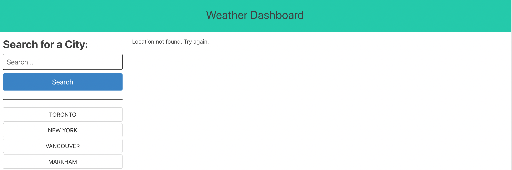
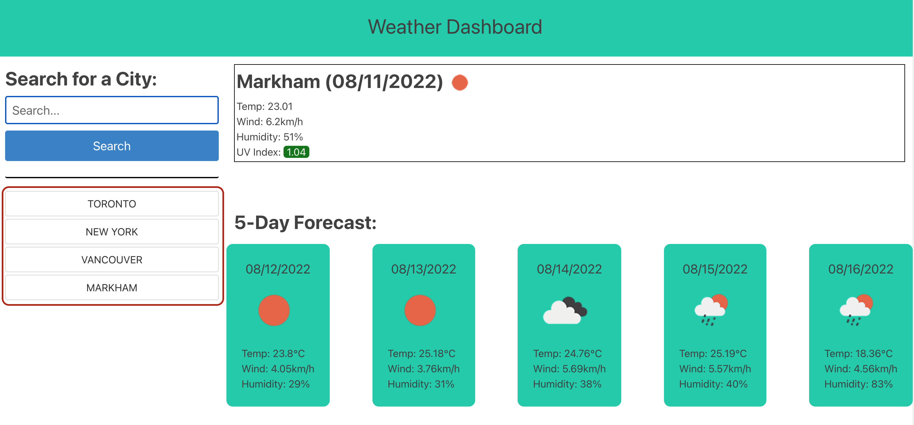

# weather-dashboard

## Purpose
This is an application that allows user to know what the current weather conditions and 5 days forecast are for a specific city by searching for a specific City. User can narrow down the city name by adding "," follow by State/province Code or country code.

### Feature Screenshots
* User is presented with homepage where user is allowed to search for a specific city.

* Once user have entered the name of a city, the applicantion will present the user with the current date's weather condition via icon, temperature measured in cleus, wind speed in km/h, the humidity, and the UV index. (Please note: the UV index will change colour based on the the number. UV index will turn green if the index is lower or equal to 2, orange above 2 and below or equal to 5, and anything above 5 will turn red.)  
* The application will also present the next 5 day forecast. In each card container will present the date, weather condition via icon, temperature, wind speed, and humidity.

* If the user entered an incorrect city name, no results will be presented and the following message will appear to prompt use to re-enter city name.

* Everytime a city name is inputed into the search bar. a history will be recorded under the search bar. This will allow users to quickly search for a previously searched city.

## Built With
* HTML
* CSS
* JavaScript
* Bulma

## Website
